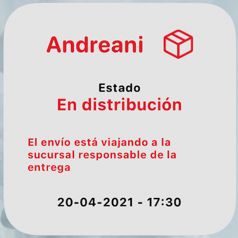
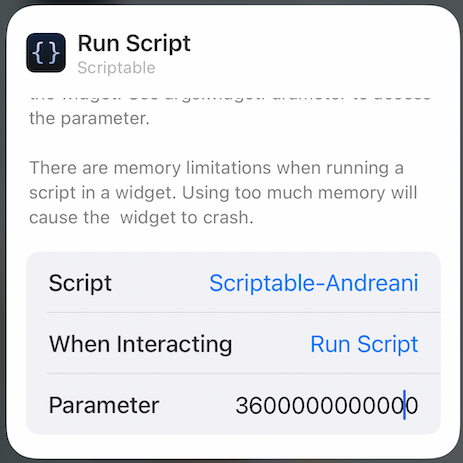
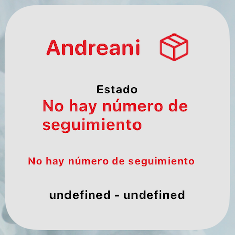

# Scriptable-Andreani
Widget para ver el estado del paquete entregado por Andreani. 

 

 
 ## ¿Cómo usarlo?
 
1) Descarga Scriptable desde la App Store.
2) Abra Scriptable y presione la tecla +
3) Pegá el contenido del script llamado "Scriptable-Andreani.js".
4) Agregue un nuevo widget al "home", y seleccione "Scriptable".
5) Mantenga presionado el widget y seleccione "Editar widget". En la sección de parámetros, en "When Interacting" ingrese la opción "Run Script", y el numero de seguimiento provisto por Andreani en "Parameter", como muestra la siguiente imagen.
 

Si el widget devuelve la siguiente imagen o muetra algun error, es debido a que no ingreso correctamente el numero de seguimiento.

6) Periódicamente, el widget se actualizará.

## Importante

Este script fue elaborado con fines totalmente didácticos, no comerciales. No hay una intencionalidad de perjudicar a Andreani. La empresa no participó en ninguna instancia del proceso. Es un proyecto individual.

## 

